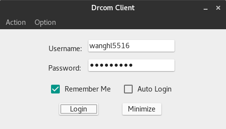
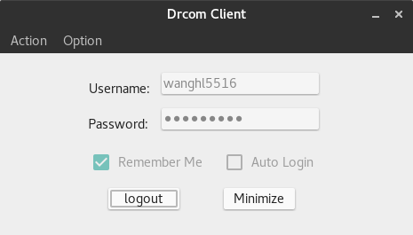
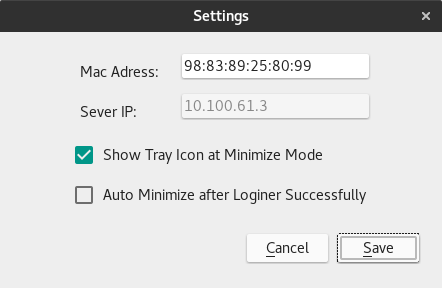
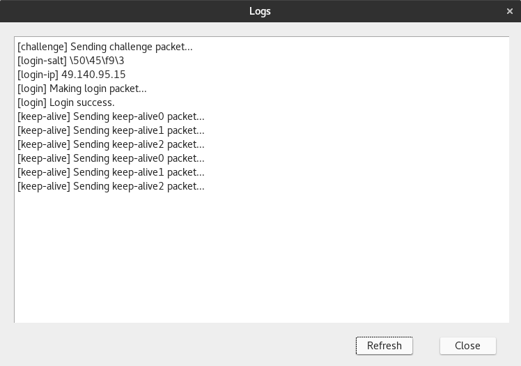
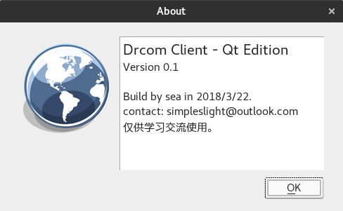

# Drcom Client (JLU) Qt Edition
---

## 吉林大学校园网第三方登录客户端

Qt/ C++ 编写

#### 功能 (可选)：

* 记住密码
* 自动登录
* 登录成功自动最小化
* 最小化托盘显示
* 查看日志
* 快捷键

#### 使用方法：

* Windows 系统下载此包 [drcom-client-qt-bin-win-0.1.7z](https://github.com/suransea/jlu-drcom-client-qt/raw/master/drcom-client-qt-bin-win-0.1.7z)

* Linux 系统下载此包    [drcom-client-qt-bin-v0.1.tar.gz](https://github.com/suransea/jlu-drcom-client-qt/raw/master/drcom-qt-bin-v0.1.tar.gz)

##### Windows

> 解压 -> 运行exe

##### Linux
> 解压:
* `$ tar -zxvf drcom-qt-bin-v0.1.tar.gz`

> 运行:
* `$ cd drcom-qt-bin-v0.1/drcom`
* `$ chmod +x jlu-drcom-client-qt.sh`
* `$ ./jlu-drcom-client-qt.sh`

程序首次运行会自动获取 MAC 地址，若登录失败可前往 Option->Settings手动更改MAC地址。 Gnome最新版（3.28）由于取消了托盘， 程序最小化后托盘图标可能出现在左上角。

drcom-client.conf 为程序配置文件，如果你知道每一项代表什么, 可以手动更改。

Server IP 出现在设置中，但默认不允许修改，如需修改请将配置文件中`server_changeable`项更改为`true`。

#### 运行截图：

-主界面1：

-主界面2：

-设置：

-日志：

-关于：

#### 项目由来：

闲暇之作， 边学Qt。

#### 感谢：

* 数据包制作参考 https://github.com/drcoms/jlu-drcom-client

#### 许可：
我也不知道这里应该写些什么。

---END---

（天堂有路你不走， 学海无涯苦作舟）

---
